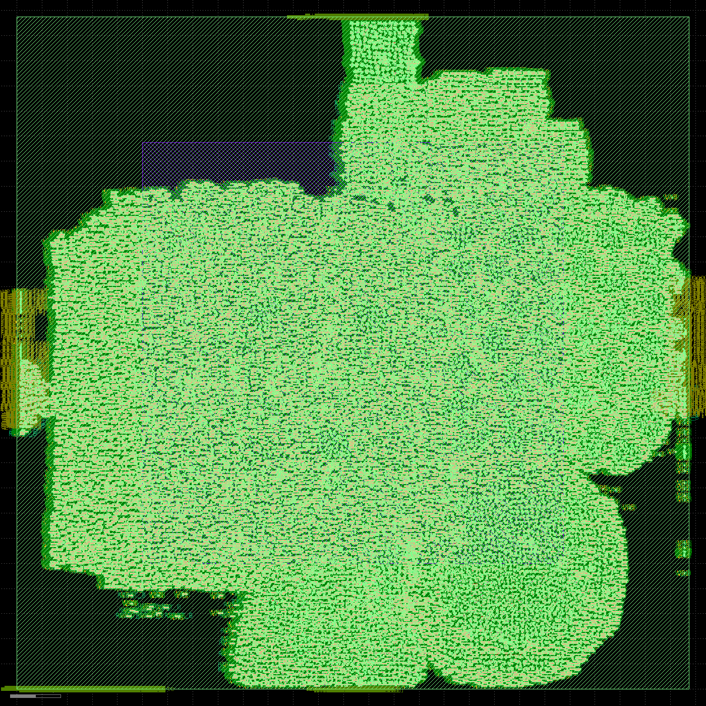

# IOMMU flow report — `full` on `sky130_fd_sc_hd`

- clock target: **400.0 MHz** (2.5 ns)  ·  corner `tt_025C_1v80`  ·  git `b59e50ad52`
- tools: yosys `Yosys 0.65 (git sha1 b85cad634, g++ 13.3.0-6ubuntu2~24.04.1 -fPIC -O3)` · openroad `26Q2-1164-g08f67ee5e` · magic `8.3.642` · klayout `KLayout 0.30.8`

## Stage pass/fail
| stage | status |
|---|---|
| synth | ✅ pass |
| pnr | ✅ pass |
| gds | ✅ pass |
| power | ✅ pass |
| ppa_stages | ✅ pass |
| layout | ✅ pass |

## PPA across stages
| stage | area | Fmax | power |
|---|---|---|---|
| post-synthesis | 616711 um² (cells) | 18.9 MHz | 0.336 W |
| post-place+repair | 659445 um² (@38%) | 55.5 MHz | 0.514 W |
| post-CTS | 696028 um² (@40%) | 55.4 MHz | 0.666 W |
| post-global-route | 696028 um² (@40%) | 54.5 MHz | 0.666 W |

## P&R power breakdown (post-groute)
| group | internal | switching | leakage | total (W) |
|---|---|---|---|---|
| sequential | 2.603e-01 | 4.779e-03 | 1.300e-07 | 2.651e-01 |
| combinational | 8.387e-02 | 1.598e-01 | 8.627e-08 | 2.436e-01 |
| clock | 8.949e-02 | 6.770e-02 | 2.114e-08 | 1.572e-01 |
| macro | 0.000e+00 | 0.000e+00 | 0.000e+00 | 0.000e+00 |
| pad | 0.000e+00 | 0.000e+00 | 0.000e+00 | 0.000e+00 |
| **total** | 4.337e-01 | 2.323e-01 | 2.374e-07 | **6.659e-01** |

## Power: default vs VCD-annotated (gate-level)
| activity | internal | switching | leakage | total (W) |
|---|---|---|---|---|
| default | 3.014e-01 | 3.478e-02 | 1.916e-07 | 3.362e-01 |
| VCD-annotated (=default) | 3.014e-01 | 3.478e-02 | 1.916e-07 | 3.362e-01 |

> VCD annotation unavailable (RTL/gate net-name mismatch after flatten); annotated power falls back to default. See USAGE_flow.md.

## Signoff (signoff/*.rpt)
- `drc.rpt` · `hold.rpt` · `timing_worstN.rpt` · `clock.rpt` · `wirelength.rpt` · `congestion.rpt`

## Layout

