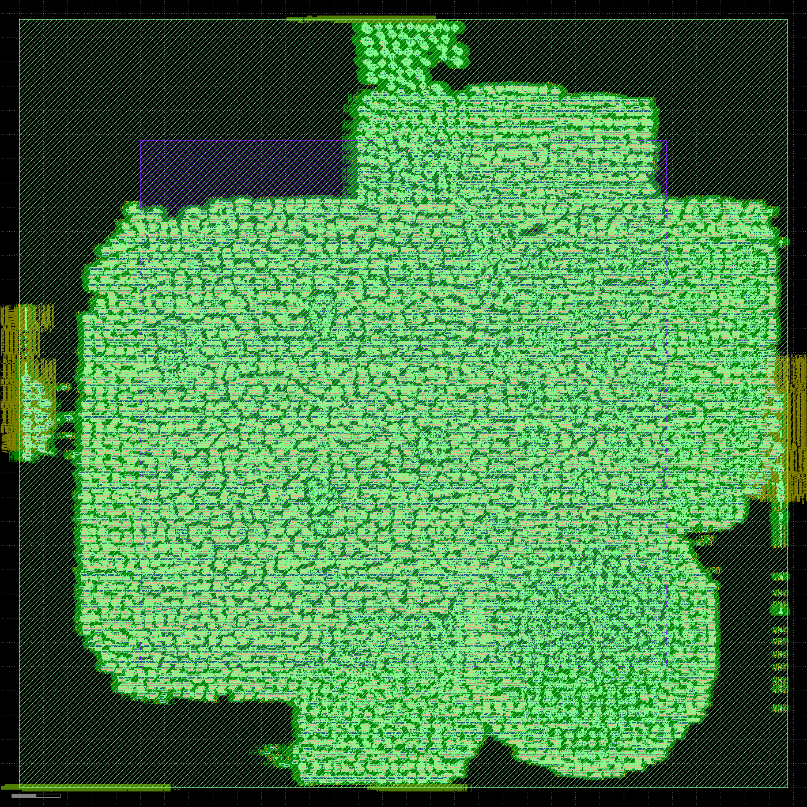

# IOMMU flow report — `full` on `sky130_fd_sc_hs`

> ⚠️ **regenerated from artifacts after an interrupted run** — this report reflects the stages that completed.

- clock target: **400.0 MHz** (2.5 ns)  ·  corner `tt_025C_1v80`  ·  git `8e437519f8`
- tools: yosys `Yosys 0.65 (git sha1 b85cad634, g++ 13.3.0-6ubuntu2~24.04.1 -fPIC -O3)` · openroad `26Q2-1164-g08f67ee5e` · magic `8.3.642` · klayout `KLayout 0.30.8`

## Stage pass/fail
| stage | status |
|---|---|
| synth | ✅ pass |
| pnr | ✅ pass |
| gds | ✅ pass |
| power | ✅ pass |
| ppa_stages | ✅ pass |
| layout | ✅ pass |

## PPA across stages
| stage | area | Fmax | power |
|---|---|---|---|
| post-synthesis | 871991 um² (cells) | 26.6 MHz | 0.563 W |
| post-place+repair | 915432 um² (@37%) | 83.2 MHz | 0.721 W |
| post-CTS | 974564 um² (@39%) | 82.2 MHz | 0.928 W |
| post-global-route | 974564 um² (@39%) | 81.2 MHz | 0.928 W |

## P&R power breakdown (post-groute)
| group | internal | switching | leakage | total (W) |
|---|---|---|---|---|
| sequential | 2.926e-01 | 6.252e-03 | 1.745e-05 | 2.989e-01 |
| combinational | 2.203e-01 | 1.847e-01 | 2.460e-06 | 4.050e-01 |
| clock | 1.286e-01 | 9.512e-02 | 6.587e-07 | 2.237e-01 |
| macro | 0.000e+00 | 0.000e+00 | 0.000e+00 | 0.000e+00 |
| pad | 0.000e+00 | 0.000e+00 | 0.000e+00 | 0.000e+00 |
| **total** | 6.415e-01 | 2.861e-01 | 2.057e-05 | **9.276e-01** |

## Power: default vs VCD-annotated (gate-level)
| activity | internal | switching | leakage | total (W) |
|---|---|---|---|---|
| default | 5.195e-01 | 4.368e-02 | 1.913e-05 | 5.632e-01 |
| VCD-annotated (=default) | 5.195e-01 | 4.368e-02 | 1.913e-05 | 5.632e-01 |

> VCD annotation unavailable (RTL/gate net-name mismatch after flatten); annotated power falls back to default. See USAGE_flow.md.

## Signoff (signoff/*.rpt)
- `drc.rpt` · `hold.rpt` · `timing_worstN.rpt` · `clock.rpt` · `wirelength.rpt` · `congestion.rpt`

## Layout

